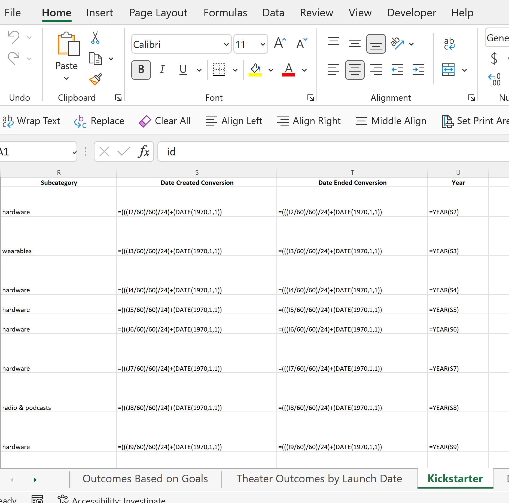
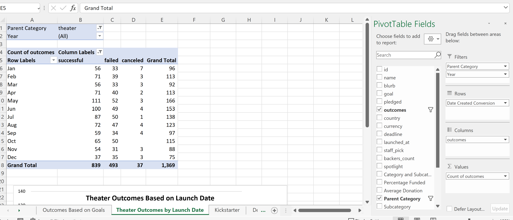
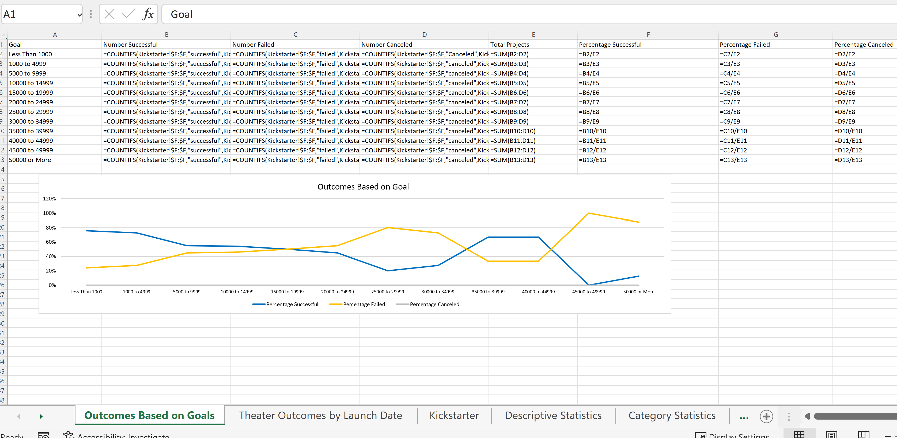
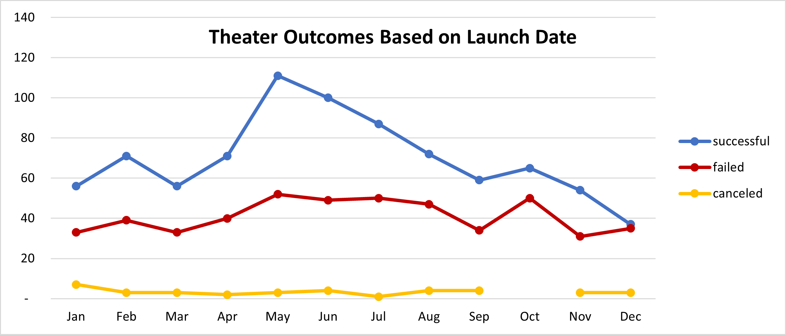
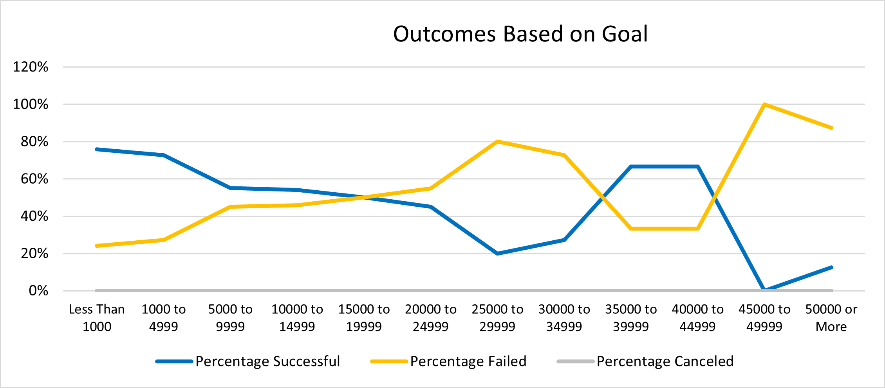

# Kickstarting with Excel

## Overview of Project
Since the crowdfunding initiative for Louise's play Fever nearly met its fundraising goal.  Louise wants to know how different campaigns fared in relation to their launch dates and their funding goals. Using the Kickstarter dataset, I visualized campaign outcomes based on their launch dates and their funding goals. 

### Purpose
This report intends to illustrate the relative success of other theater-related fundraising initiatives.

## Analysis and Challenges
To conduct the analysis, the Kickstarter dataset was amended to add a column to capture the year that fundraising initiatives were created.  

After I augmented the Kickstarter dataset, I created a pivot table and related chart (Theater Outcomes by Launch Date) to visualize the number of successful, failed, and canceled fundraising campaigns in the Theater Parent Category.

To drill into the data further, I segemented the Kickstarter dataset by fundraising Goal amounts for the Play Subcategory.  This was accomplished by creating a data table of successful, failed, and canceled Play fundraising campaigns by using the COUNTIFS formula.  The subset of Play data was compared by calculating the percentages of successful, failed, and canceled initiatives by Goal amount.  

After creating the data table, I created a line chart to visualize the fundraising outcomes by goal.

### Analysis of Outcomes Based on Launch Date

### Analysis of Outcomes Based on Goals

### Challenges and Difficulties Encountered

This Challenge took longer than normal to finish due to misunderstanding how to isolate the calendar months from the Date Created Conversion attribute.  To overcome this hurdle, I had to revert back to the Module lessons to relearn how to remove the year and quarter designations.

## Results

- What are two conclusions you can draw about the Outcomes based on Launch Date?

After reviewing the Theater Outcome Based on Launch Date chart, it was evident that May was the best month to launch a Kickstarter campaign.  The number of fundraisers started in May by far had the greatest success when compared to any other month.

Alternatively, the number of failed campaigns was not abnormally above average in May.  The number of failed fundraisers shown for May was in line with June, July, August, and October.

- What can you conclude about the Outcomes based on Goals?

Another interesting fact was discoverd after reviewing the Outcomes Based on Goal chart.  A project's success was not linearly correlated to the value of the project goal.  Based on the data, play-related fundraisers should aim for goal amounts between $1 and $15,000 or between $35,000 and $45,000.

When segmented by goal amount, fundraisers under $5,000 were more likely to be successful, but their relative success tapered off as the goal amount increased.  Goals between $15,000 and $35,000 were more likely to fail than success as a percentage of total projects; however, this trend reverses itself between $35,000 and $45,000 where fundraising projects were more likely to be successful.  

- What are some limitations of this dataset?

This dataset could be improved by including more detail regarding the Theater Category and Plays Subcategory.  More qualitative information (e.g., Play Type - Action, Play Type - Drama, etcetera) would help analysts categorize the data further and draw more targeted conclusions from the dataset.

- What are some other possible tables and/or graphs that we could create?

It would be great to create tables and visualizations that relate the length of the Kickstarter campaign with each project's success or failure.  This information would help Louise choose the optimal time to keep her Kickstarter campaign open.
